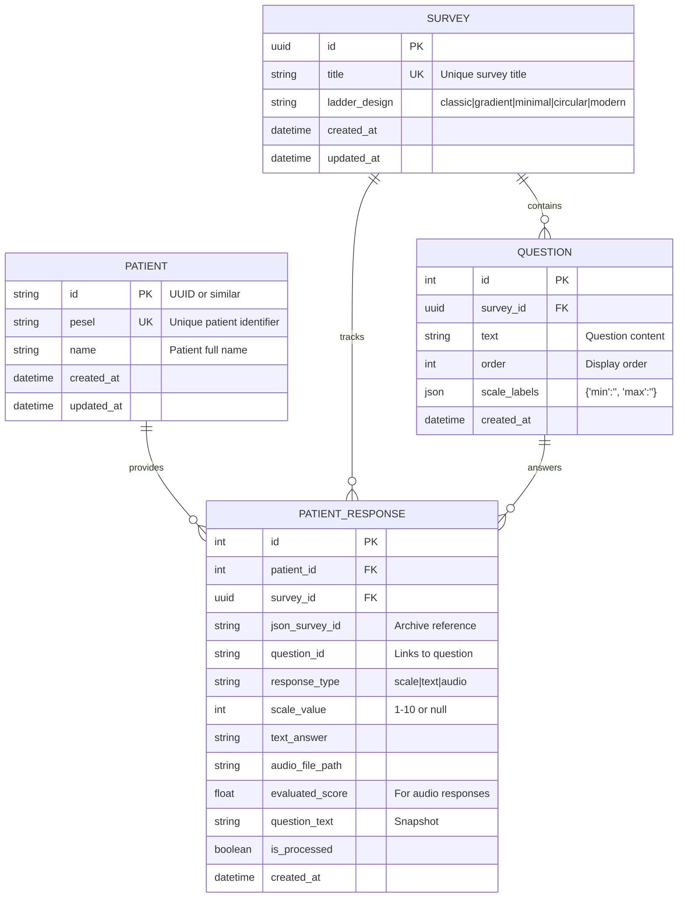
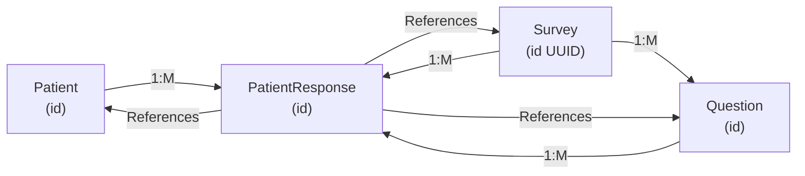

# Database Schema - Cantril Ladder System

## 1. Entity Relationship Diagram (ERD)



## 2. Detailed Table Schemas

### Table: `cantrilapp_patient`

```sql
CREATE TABLE cantrilapp_patient (
    id INTEGER PRIMARY KEY AUTOINCREMENT,
    pesel VARCHAR(11) UNIQUE NOT NULL,
    name VARCHAR(255),
    created_at TIMESTAMP DEFAULT CURRENT_TIMESTAMP,
    updated_at TIMESTAMP DEFAULT CURRENT_TIMESTAMP,
    
    INDEX idx_pesel (pesel)
);

-- Sample Record:
-- id=1, pesel='12345678901', name='Jan Kowalski', created_at='2025-12-30 10:00:00'
```

**Fields:**
| Column | Type | Constraint | Purpose |
|--------|------|-----------|---------|
| `id` | INT | PRIMARY KEY | Auto-incremented identifier |
| `pesel` | VARCHAR(11) | UNIQUE, NOT NULL | Polish patient ID (11 digits) |
| `name` | VARCHAR(255) | OPTIONAL | Patient full name |
| `created_at` | TIMESTAMP | NOT NULL | Record creation time |
| `updated_at` | TIMESTAMP | NOT NULL | Last modification time |

**Indexes:**
- `idx_pesel`: Fast lookup by PESEL

---

### Table: `cantrilapp_survey`

```sql
CREATE TABLE cantrilapp_survey (
    id CHAR(36) PRIMARY KEY,  -- UUID
    title VARCHAR(255) UNIQUE NOT NULL,
    ladder_design VARCHAR(50) DEFAULT 'classic',
    created_at TIMESTAMP DEFAULT CURRENT_TIMESTAMP,
    updated_at TIMESTAMP DEFAULT CURRENT_TIMESTAMP,
    
    INDEX idx_title (title),
    INDEX idx_created_at (created_at)
);

-- Sample Records:
-- id='550e8400-e29b-41d4-a716-446655440000', title='SIEMA', ladder_design='minimal'
-- id='550e8400-e29b-41d4-a716-446655440001', title='Nowa Ankieta', ladder_design='gradient'
```

**Fields:**
| Column | Type | Constraint | Purpose |
|--------|------|-----------|---------|
| `id` | CHAR(36) | PRIMARY KEY | UUID v4 - unique survey identifier |
| `title` | VARCHAR(255) | UNIQUE, NOT NULL | Survey name (e.g., "SIEMA") |
| `ladder_design` | VARCHAR(50) | DEFAULT 'classic' | Visual style of ladder (5 options) |
| `created_at` | TIMESTAMP | NOT NULL | Creation timestamp |
| `updated_at` | TIMESTAMP | NOT NULL | Last update timestamp |

**Ladder Design Options:**
- `classic` - Blue gradient
- `gradient` - Dynamic gradient
- `minimal` - Simple style
- `circular` - Modern circular
- `modern` - Bold style

**Indexes:**
- `idx_title`: Fast survey lookup by name
- `idx_created_at`: Time-based queries

---

### Table: `cantrilapp_question`

```sql
CREATE TABLE cantrilapp_question (
    id INTEGER PRIMARY KEY AUTOINCREMENT,
    survey_id CHAR(36) NOT NULL,
    text TEXT NOT NULL,
    order INTEGER NOT NULL,
    scale_labels JSON DEFAULT '{"min":"","max":""}',
    created_at TIMESTAMP DEFAULT CURRENT_TIMESTAMP,
    
    FOREIGN KEY (survey_id) REFERENCES cantrilapp_survey(id) ON DELETE CASCADE,
    INDEX idx_survey_order (survey_id, order),
    INDEX idx_survey (survey_id)
);

-- Sample Records:
-- id=1, survey_id='550e8400...', text='Jak się czujesz?', order=1, 
--   scale_labels='{"min":"Źle","max":"Doskonale"}'
-- id=2, survey_id='550e8400...', text='Poziom energii?', order=2,
--   scale_labels='{"min":"Zmęczony","max":"Pełen energii"}'
```

**Fields:**
| Column | Type | Constraint | Purpose |
|--------|------|-----------|---------|
| `id` | INT | PRIMARY KEY | Auto-incremented |
| `survey_id` | CHAR(36) | FOREIGN KEY | References Survey |
| `text` | TEXT | NOT NULL | Question content |
| `order` | INT | NOT NULL | Display order (1, 2, 3...) |
| `scale_labels` | JSON | DEFAULT {...} | Min/max labels for scale |
| `created_at` | TIMESTAMP | NOT NULL | Creation time |

**scale_labels JSON Structure:**
```json
{
  "min": "Najgorzej",
  "max": "Najlepiej"
}
```

**Indexes:**
- `idx_survey_order`: Fast retrieval of questions in order
- `idx_survey`: All questions for a survey

---

### Table: `cantrilapp_patientresponse`

```sql
CREATE TABLE cantrilapp_patientresponse (
    id INTEGER PRIMARY KEY AUTOINCREMENT,
    patient_id INTEGER NOT NULL,
    survey_id CHAR(36) NULL,
    json_survey_id VARCHAR(255),
    question_id VARCHAR(50),
    response_type VARCHAR(20) NOT NULL,  -- scale|text|audio
    scale_value INTEGER,  -- 1-10 or NULL
    text_answer TEXT,
    audio_file_path VARCHAR(255),
    evaluated_score FLOAT NULL,  -- AI-evaluated score for audio
    question_text TEXT,  -- Snapshot of question at time of answer
    is_processed BOOLEAN DEFAULT FALSE,
    created_at TIMESTAMP DEFAULT CURRENT_TIMESTAMP,
    
    FOREIGN KEY (patient_id) REFERENCES cantrilapp_patient(id) ON DELETE CASCADE,
    FOREIGN KEY (survey_id) REFERENCES cantrilapp_survey(id) ON DELETE SET NULL,
    INDEX idx_patient (patient_id),
    INDEX idx_survey (survey_id),
    INDEX idx_json_survey_id (json_survey_id),
    INDEX idx_created_at (created_at),
    INDEX idx_response_type (response_type),
    UNIQUE(patient_id, survey_id, question_id, created_at)
);

-- Sample Records:
-- id=1, patient_id=1, survey_id='550e8400...', json_survey_id='survey_v1', 
--   question_id='q1', response_type='scale', scale_value=7, 
--   question_text='Jak się czujesz?', created_at='2025-12-30 10:15:00'
--
-- id=2, patient_id=1, survey_id='550e8400...', json_survey_id='survey_v1',
--   question_id='q2', response_type='audio', audio_file_path='audio_answers/...',
--   evaluated_score=8.5, created_at='2025-12-30 10:20:00'
```

**Fields:**
| Column | Type | Constraint | Purpose |
|--------|------|-----------|---------|
| `id` | INT | PRIMARY KEY | Auto-incremented |
| `patient_id` | INT | FOREIGN KEY | Patient who answered |
| `survey_id` | CHAR(36) | FOREIGN KEY | Survey taken |
| `json_survey_id` | VARCHAR(255) | INDEX | Archive/webhook reference |
| `question_id` | VARCHAR(50) | - | Question identifier (e.g., q1, q2) |
| `response_type` | VARCHAR(20) | NOT NULL | Type: scale, text, or audio |
| `scale_value` | INT | NULLABLE | 1-10 for scale responses |
| `text_answer` | TEXT | NULLABLE | Text response |
| `audio_file_path` | VARCHAR(255) | NULLABLE | Path to audio file |
| `evaluated_score` | FLOAT | NULLABLE | AI-evaluated score |
| `question_text` | TEXT | - | Question snapshot at time of response |
| `is_processed` | BOOLEAN | DEFAULT FALSE | Processing by n8n |
| `created_at` | TIMESTAMP | NOT NULL | Response timestamp |

**response_type Values:**
- `scale` - Ladder 1-10 selection
- `text` - Text input response
- `audio` - Audio recording response

**Indexes:**
- `idx_patient`: All responses for a patient
- `idx_survey`: All responses to a survey
- `idx_json_survey_id`: Archive lookup
- `idx_created_at`: Time-based queries
- `idx_response_type`: Filter by type
- UNIQUE composite: Prevent duplicate responses

---

## 3. Relationships & Foreign Keys



**Cascade Rules:**
- `Patient` DELETE → Delete all `PatientResponse` (CASCADE)
- `Survey` DELETE → Delete all `Question` and `PatientResponse` (CASCADE)

---

## 4. Query Examples

### List all questions for a survey:
```sql
SELECT q.id, q.text, q.order, q.scale_labels
FROM cantrilapp_question q
WHERE q.survey_id = '550e8400-e29b-41d4-a716-446655440000'
ORDER BY q.order ASC;
```

### Get patient response history:
```sql
SELECT pr.*, q.text
FROM cantrilapp_patientresponse pr
JOIN cantrilapp_question q ON pr.question_id = q.id
WHERE pr.patient_id = 1
ORDER BY pr.created_at DESC;
```

### Count responses per survey:
```sql
SELECT 
    s.title, 
    COUNT(DISTINCT pr.patient_id) as patient_count,
    COUNT(pr.id) as response_count
FROM cantrilapp_survey s
LEFT JOIN cantrilapp_patientresponse pr ON s.id = pr.survey_id
GROUP BY s.id
ORDER BY response_count DESC;
```

### Average scale values per question:
```sql
SELECT 
    q.text,
    AVG(pr.scale_value) as avg_score,
    MIN(pr.scale_value) as min_score,
    MAX(pr.scale_value) as max_score
FROM cantrilapp_question q
LEFT JOIN cantrilapp_patientresponse pr ON q.id = pr.question_id
WHERE q.survey_id = '550e8400-e29b-41d4-a716-446655440000'
  AND pr.response_type = 'scale'
GROUP BY q.id;
```

### Last response per patient per survey:
```sql
SELECT DISTINCT ON (pr.patient_id) 
    pr.patient_id, pr.survey_id, pr.created_at
FROM cantrilapp_patientresponse pr
ORDER BY pr.patient_id, pr.created_at DESC;
```

---

## 5. JSON Field Structure (scale_labels)

### In Database:
```json
{
  "min": "Najgorzej",
  "max": "Najlepiej"
}
```

### In Django Template Access:
```django
{{ question.scale_labels.min }}  <!-- "Najgorzej" -->
{{ question.scale_labels.max }}  <!-- "Najlepiej" -->
```

### In Python ORM:
```python
question = Question.objects.get(id=1)
print(question.scale_labels)  # {'min': 'Najgorzej', 'max': 'Najlepiej'}
print(question.scale_labels.get('min'))  # 'Najgorzej'
```

---

## 6. Data Types & Constraints

| Type | Django | SQL | Example |
|------|--------|-----|---------|
| ID (UUID) | `UUIDField` | `CHAR(36)` | `550e8400-e29b-41d4-a716-446655440000` |
| ID (Auto) | `AutoField` | `INTEGER` | `1, 2, 3...` |
| Text (Long) | `TextField` | `TEXT` | Full question text |
| JSON | `JSONField` | `JSON` | `{"min":"","max":""}` |
| Timestamp | `DateTimeField` | `TIMESTAMP` | `2025-12-30 10:15:00` |
| Boolean | `BooleanField` | `BOOLEAN` | `True/False` |
| Foreign Key | `ForeignKey` | `INTEGER` | References parent ID |
| Unique | `unique=True` | `UNIQUE` | One per table |

---

## 7. Indexing Strategy

### Primary Indexes (High Priority):
```sql
CREATE INDEX idx_patient ON cantrilapp_patientresponse(patient_id);
CREATE INDEX idx_survey ON cantrilapp_patientresponse(survey_id);
CREATE INDEX idx_json_survey_id ON cantrilapp_patientresponse(json_survey_id);
CREATE INDEX idx_created_at ON cantrilapp_patientresponse(created_at);
```

### Composite Indexes:
```sql
CREATE INDEX idx_survey_order ON cantrilapp_question(survey_id, order);
CREATE INDEX idx_patient_survey ON cantrilapp_patientresponse(patient_id, survey_id);
```

### Performance Impact:
- **Read**: Fast ✅ (O(log n))
- **Write**: Slightly slower (index maintenance)
- **Storage**: +15-20% disk space for indexes

---

## 8. Data Volume Estimates (for 1000 patients)

| Table | Records | Disk Space |
|-------|---------|-----------|
| `Patient` | 1,000 | ~100 KB |
| `Survey` | 10 | ~5 KB |
| `Question` | 50 | ~10 KB |
| `PatientResponse` | 500,000 | ~50-100 MB |
| **Total** | ~501K | ~150 MB |

*Note: Assumes 500 responses per patient (50 surveys × 10 questions each)*

---

## 9. Migration Files (Django)

### Initial Migration:
```python
# cantrilapp/migrations/0001_initial.py

class Migration(migrations.Migration):
    initial = True
    dependencies = []
    
    operations = [
        migrations.CreateModel(
            name='Patient',
            fields=[
                ('id', models.AutoField(...)),
                ('pesel', models.CharField(unique=True, max_length=11)),
                ('name', models.CharField(max_length=255, blank=True)),
                ('created_at', models.DateTimeField(auto_now_add=True)),
            ],
        ),
        migrations.CreateModel(
            name='Survey',
            fields=[
                ('id', models.UUIDField(primary_key=True, default=uuid.uuid4)),
                ('title', models.CharField(unique=True, max_length=255)),
                ('ladder_design', models.CharField(max_length=50, default='classic')),
            ],
        ),
        # ... more models
    ]
```

---

## 10. Backup & Recovery Strategy

### Backup Files:
```
ankieta_pytania.json          # Current active survey
surveys/UUID.json             # Per-survey backup
outbox/survey_id_patient_id.json  # Response archives
```

### Database Backup (SQLite):
```bash
# Full backup
cp db.sqlite3 db.sqlite3.backup_$(date +%Y%m%d_%H%M%S)

# For PostgreSQL:
pg_dump -U username database_name > backup.sql
```

### Recovery:
```bash
# Restore SQLite
cp db.sqlite3.backup_20251230_151451 db.sqlite3

# Restore PostgreSQL
psql -U username database_name < backup.sql
```

---

**Database Schema Version**: 1.0  
**Last Updated**: 2025-12-30  
**Django ORM**: Tested on Django 4.x  
**Databases Supported**: SQLite, PostgreSQL, MySQL
