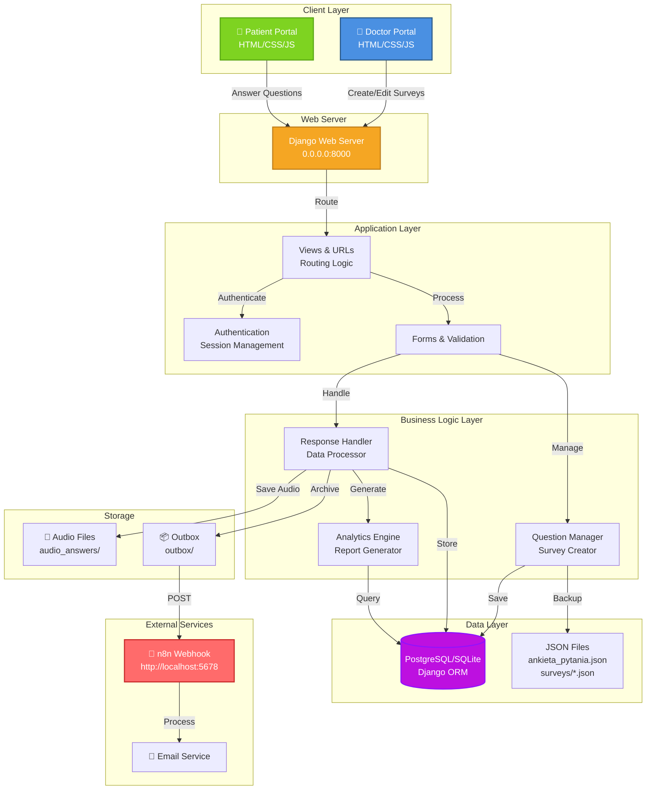
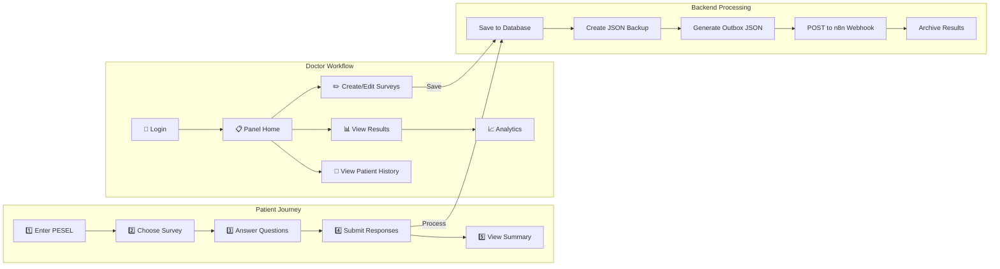
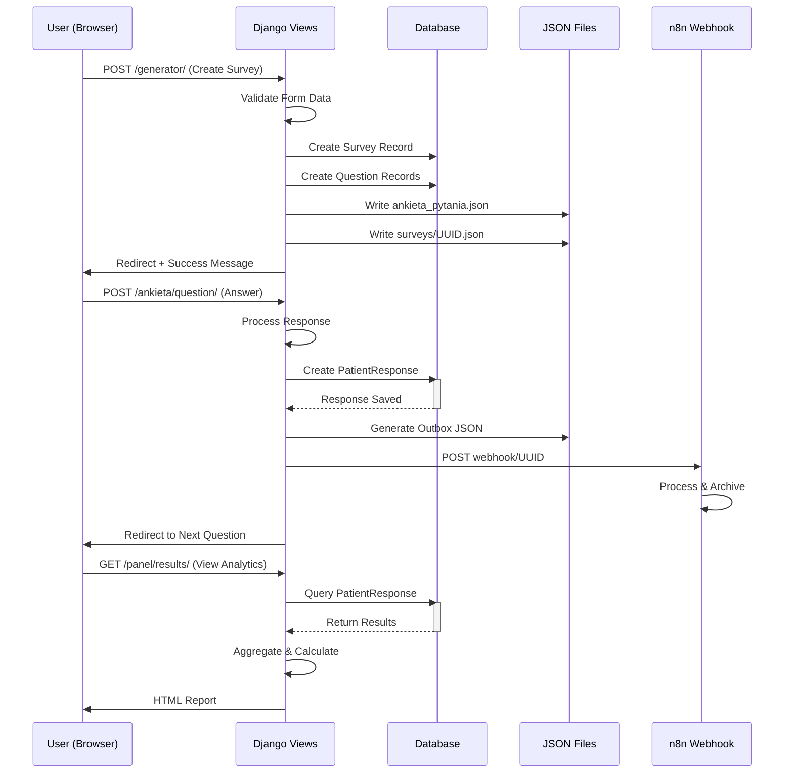
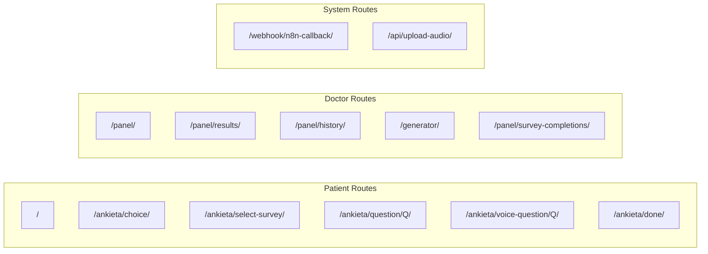
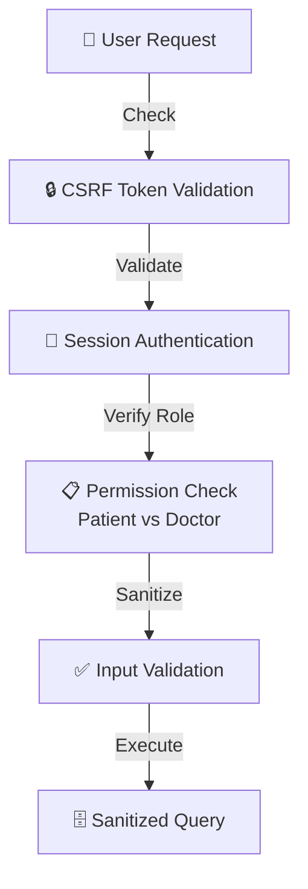

# System Architecture - Cantril Ladder Quality of Life Measurement Platform

## 1. High-Level System Architecture



## 2. Detailed Component Flow



## 3. Data Flow Architecture

```mermaid
graph TD
    subgraph "Survey Creation Flow"
        SC1["Admin Input<br/>Title, Design, Questions"] -->|POST /generator/| SC2["manage_questions View"]
        SC2 -->|Validate| SC3["Form Validation"]
        SC3 -->|Create| SC4["Survey Model<br/>UUID Primary Key"]
        SC4 -->|Create| SC5["Question Model<br/>Multiple Records"]
        SC5 -->|Serialize| SC6["ankieta_pytania.json"]
        SC6 -->|Backup| SC7["surveys/UUID.json"]
    end
    
    subgraph "Survey Response Flow"
        SR1["Patient Answer<br/>PESEL + Responses"] -->|POST /ankieta/question/| SR2["ankieta_cantril_question View"]
        SR2 -->|Store| SR3["Session['answers']"]
        SR3 -->|Submit| SR4["PatientResponse Model"]
        SR4 -->|Create| SR5["Multiple Response Records<br/>per Question"]
        SR5 -->|Generate| SR6["Outbox JSON<br/>survey_id_patient_id.json"]
        SR6 -->|Webhook| SR7["n8n Processing"]
    end
    
    subgraph "Analytics Flow"
        A1["Doctor Query<br/>GET /panel/results/"] -->|Filter| A2["PatientResponse Query"]
        A2 -->|Aggregate| A3["Count, Group By"]
        A3 -->|Calculate| A4["Statistics<br/>Avg, Min, Max"]
        A4 -->|Render| A5["HTML Report<br/>Charts"]
    end
```



## 4. Request/Response Cycle



## 5. File Structure & Storage

```
/home/wiktor-kowalczyk/cantrilladder/
│
├── Cantril/                          # Django Project Root
│   ├── manage.py                     # Django Management
│   ├── requirements.txt              # Dependencies
│   ├── db.sqlite3                    # SQLite Database
│   ├── ankieta_pytania.json         # Active Survey Config
│   │
│   ├── Cantril/                      # Project Settings
│   │   ├── settings.py
│   │   ├── urls.py
│   │   └── wsgi.py
│   │
│   ├── cantrilapp/                   # Main Application
│   │   ├── models.py                 # ORM Models
│   │   ├── views.py                  # Business Logic
│   │   ├── urls.py                   # URL Routing
│   │   ├── admin.py                  # Django Admin
│   │   │
│   │   ├── migrations/               # Database Migrations
│   │   │   ├── 0001_initial.py
│   │   │   └── ...
│   │   │
│   │   ├── templates/                # HTML Templates
│   │   │   ├── base.html
│   │   │   ├── generator.html        # Survey Creator
│   │   │   ├── ankieta_question.html # Patient Survey
│   │   │   ├── panel_home.html       # Doctor Dashboard
│   │   │   ├── panel_results.html    # Analytics
│   │   │   └── ...
│   │   │
│   │   └── management/               # Custom Commands
│   │
│   ├── surveys/                      # Archive (per-survey JSON)
│   │   ├── UUID1.json
│   │   ├── UUID2.json
│   │   └── ...
│   │
│   ├── audio_answers/                # Patient Audio Recordings
│   │   ├── PESEL_q1.wav
│   │   └── ...
│   │
│   ├── outbox/                       # Response Archives
│   │   ├── survey_id_patient_id.json
│   │   └── ...
│   │
│   ├── static/                       # CSS, JS, Images
│   │   ├── base.css
│   │   └── ...
│   │
│   └── venv/                         # Python Virtual Environment
│
└── README.md
```

## 6. API Endpoints Structure



## 7. Technology Stack

```
┌─────────────────────────────────────────┐
│  Frontend                               │
├─────────────────────────────────────────┤
│ • HTML5                                 │
│ • CSS3 (Responsive Design)              │
│ • JavaScript (Vanilla + ES6)            │
│ • Audio Recording API                   │
│ • Drag & Drop File Upload               │
└─────────────────────────────────────────┘
         ↓
┌─────────────────────────────────────────┐
│  Backend - Django Framework             │
├─────────────────────────────────────────┤
│ • Python 3.10+                          │
│ • Django 4.x                            │
│ • Django ORM                            │
│ • Built-in Admin Panel                  │
│ • Middleware for Auth                   │
└─────────────────────────────────────────┘
         ↓
┌─────────────────────────────────────────┐
│  Database Layer                         │
├─────────────────────────────────────────┤
│ • SQLite (Development)                  │
│ • PostgreSQL (Production-ready)         │
│ • JSONField for scale_labels            │
└─────────────────────────────────────────┘
         ↓
┌─────────────────────────────────────────┐
│  External Services                      │
├─────────────────────────────────────────┤
│ • n8n (Workflow Automation)             │
│ • Webhook for Data Processing           │
└─────────────────────────────────────────┘
```

## 8. Key Design Patterns

| Pattern | Implementation | Purpose |
|---------|----------------|---------|
| **MVC** | Django Views → Models → Templates | Separation of concerns |
| **Session** | Django Sessions | Patient state management |
| **Repository** | ORM Models | Data abstraction |
| **Outbox** | JSON files in outbox/ | Reliable message delivery |
| **Webhook** | n8n callback | Async data processing |
| **Factory** | Question creation | Dynamic survey building |

## 9. Security Architecture



## 10. Scalability Considerations

- **Horizontal**: Load balancing with Gunicorn/uWSGI
- **Database**: PostgreSQL with indexes on json_survey_id, patient_id
- **Cache**: Redis for session storage
- **Async**: Celery for n8n webhooks and audio processing
- **Storage**: S3/Cloud storage for audio files and outbox archives

---

**Generated for**: Cantril Ladder Quality of Life Measurement Platform  
**Version**: 1.0  
**Date**: 2025-12-30
